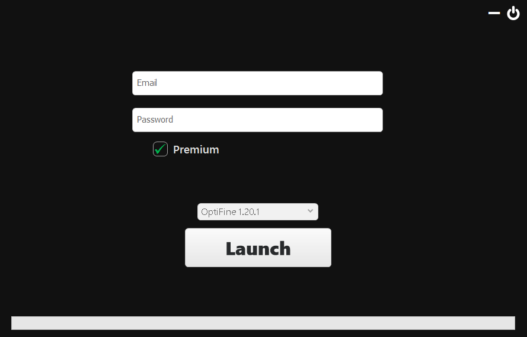

# Minecraft Launcher

**Minecraft Launcher** base written in C#. 
A simple launcher that allows users to log in, select a game version, and launch Minecraft. 
 
 

# Details
- Written in C#.
- Uses Windows Forms for the GUI.
- Allows users to enter account credentials.
- Supports selecting different Minecraft versions before launch.
- Launches Minecraft with the selected configuration.
 

# Medias
  
